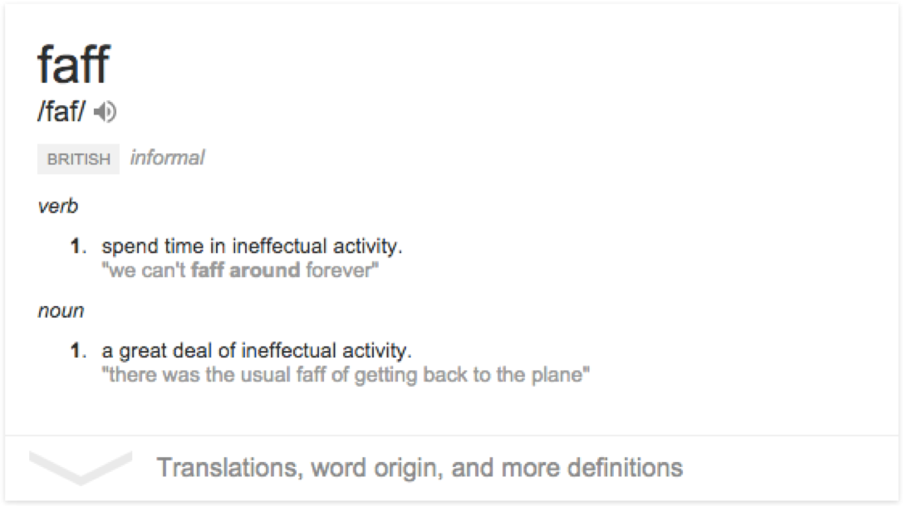
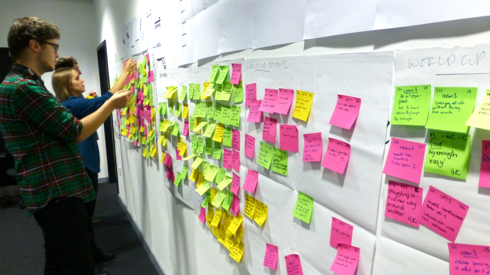
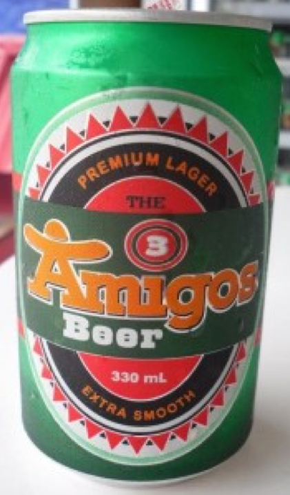
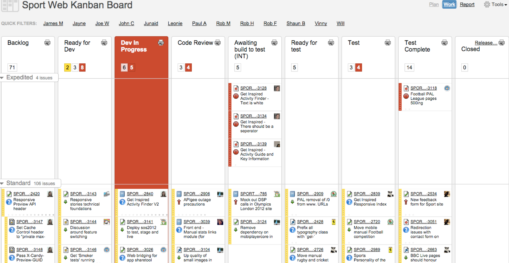
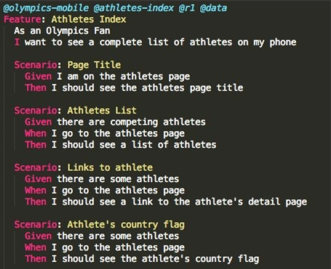
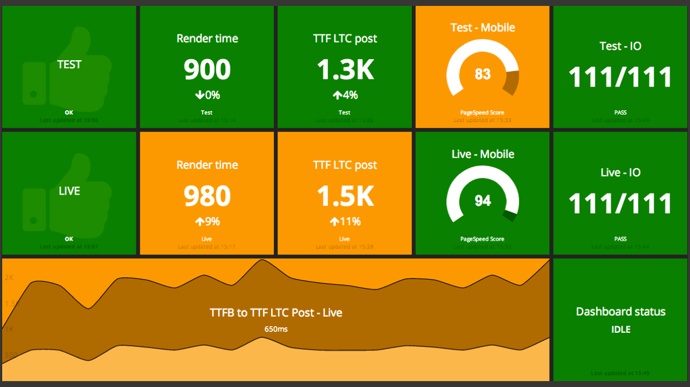
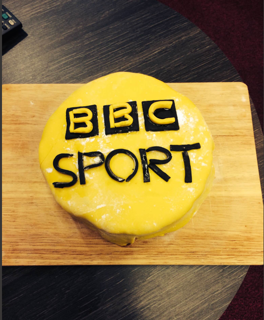

# [fit] How We Work

---
# [fit]Happy & Efficient Team

---
# Faff

---

# Process

---

# The Daily Cycle

---

---

# __Huh__ ?

---

# Communication

---

# ~~__3__~~ 4 Amigos

---

# Basic Agile Process

 - Scrum, Kanban, Scrumban, WaterScrumBan, WTF?
 - Daily standups, small increments
 - Minimal Viable Product (**MVP**)

---

# Common Language
- Gherkin
- Cucumber
- __Err, say What?__  Plain English

---

# Automation Tests __&__ Fast Feedback

---

# The Best Bit?
## __You__ know __when you are done!__

---

# [fit] Value __to our__ audiences

---

# [fit]__When Things Go__ Bad…

## [fit] __~~BLAME~~__ Cake!

---

## Questions?

