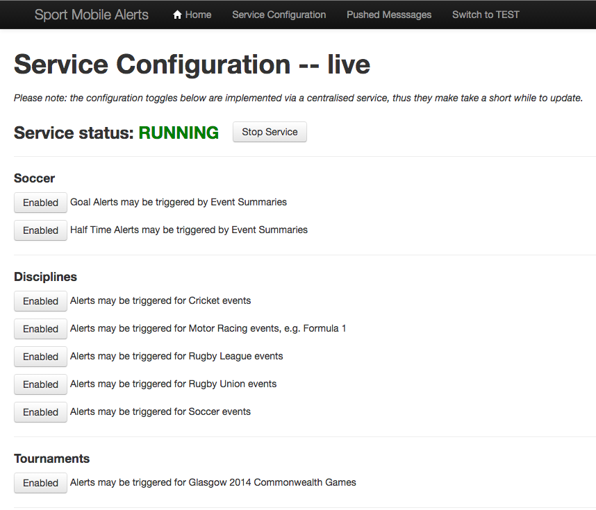

# [fit] Sports Data & Mobile Alerts

# [fit] Getting you data **_faster_** than Usain Bolt

---

# [fit] **_Live_** Experience

^ People want to feel connected to sporting events and feel involved in the action.

^ Products we build in sport rely on getting sports information and making it quickly usable and available on our site and mobile apps.

---

# What sort of data?

- Scores
- Schedules
- Standings
- Stats
- News

^ Schedules meaning fixtures for sports events
  Standings are things like league tables or group tables
  Stats might be for example how many goals has Lionel Messi scored with his right foot
  News might be live text commentary of a cricket match
  
---

# Where does Sports Data come from?

Supplied by companies such as:

- OPTA
- Press Association

They supply data feeds:

- XML documents which describe something happening at a sport event

^ The BBC doesn't have to go and collect sports data.

---

^ This chap is watching a football match live and someone scores.

^ He would use that interface in front of him to record the goal, the scorer the time and so on.

---

^ That would produce a document like this with all the information we need to send a goal alert

---

---

---

# [fit] **_Fantastic!_**

^ Job done right?

^ We could just put that data on the website can't we?

---

# [fit] Documents differ by company and sport

- OPTA document structure != PA document structure
- OPTA Rugby != OPTA Soccer
- Format of dates and times is inconsistent

# [fit] :-(

^ Trying to parse and interpret documents can be tricky as they aren't consistent.

^ Document structure varies between OPTA and PA.

^ Also variations between the structure used for different sports supplied by the same company.

---

# Sports Event Data Collection

- We built a service to abstract away the differences
  - Called **_Sportsdata Suite_**
- Produces documents containing **_SportsML_**
  - XML exchange standard of the _**International Press Telecommunications Council**_.
- Used by various clients within the BBC

^ Runs on The BBC's own managed infrastructure platform called Forge.

^ IPTC is the global media news standards body.

^ SportsML is the language used by the IPTC to describe sports scores, schedules, standings, stats and news.

---

^ Lets fast forward in time to where Germany have beaten Scotland 3 - 2.

^ Here is the SportsML for that.

---

---

Once we have this information we can use it in useful places for the audience.

---

---

---

---

---

---

# One source of truth

Sportsdata Suite provides this data to

- Sport Website
- Sport Mobile App
- Connected TV Sport App
- Red Button+ Service

...and the **_Mobile Alerts_** service uses this too.

^ Can take you through how Mobile Alerts works as an example of what we do with the data.

---

# [fit] What is the **_Mobile Alerts_** Service?

---

### "Whether it's the Women's World Cup, the Ashes, the FA Cup final or your football team or cricket county, the BBC Sport app is **_the one place_** where you can get alerts for all the sport that matters to you[^4]."

[^4]: Source: http://www.bbc.co.uk/sport/0/20928565

^ Press announcement for the service which sums it up.

---

^ Notifications which are pushed to your phone.

^ Pop up on the homescreen showing key information.

---

---

---

---

---

# [fit] You need sport updates
# [fit] **_Now!_**

^ Why would you want them?

---

# [fit] You want to watch it **_live_**... but...
- it's **_not a convenient time_**, or
- you **_don't have access_**.

---

# Configurable!

^ Don't watch qualifying so I want to know who got pole

^ Watch the recorded race in the evening so I don't want to know the result

---

# [fit] How do Mobile Alerts work then?

^ Lets use someone scoring a goal in a football match as an example, its more interesting than a medal alert.

---

^ Back into the past again.

^ Here is Germany's first goal against Scotland as output by Sportsdata Suite in SportsML.

---

---

---

^ Mobile Alerts is a node.js application we built running on Amazon Web Services.

^ Data flows through it by being parsed by the message handler then handed off to a sport specific parser and formatter, before being sent out by the message sender.

^ Parser strips relevant information from the document - team names, scores and the name of the scorer of the goal.

^ The formatter turns that information into a sensibly worded alert.

---

---

# Sometimes we get the same file **_twice_**...

^ We use a database to store all of the messages we have sent.

^ When we generate a message we check in our database to see if we have already sent it and if we have we simply throw it away.

---

# We send to **_millions_** of mobile devices

We use a push notification platform

- called Boxcar,
- supplied by ProcessOne.

---

---

^ a recap

---

# [fit] How long does it take?

---

^ Usain would need to run a bit quicker to beat us.

---

# [fit] Are they
# [fit] **_fast_**
# [fit] enough?

---

# [fit] Fast enough!

---

# How do we **_develop_** Mobile Alerts?

- Test Driven Development
- IntelliJ and GitHub
- Pull requests

---

# How do we **_test_** it?

- Fully automated with mocha and sinon.
  - No manual testing.
- 700 unit and integration tests ~30 seconds to run.
- 50 'end to end' tests.

---

---

# How do we **_deploy_** it?

- Fully automated build and deploy with Jenkins using AWS tools.
- Merged PRs go straight out to **_LIVE_**
  - if they pass the tests,
- Takes about ten minutes.

---

# Dynamic Config

---

# [fit] Questions?

---

# [fit] We are hiring!

Get in touch if you want a job:

- keith.mitchell@bbc.co.uk
- joe.sparrow@bbc.co.uk

# [fit] Its a great place to work :-)