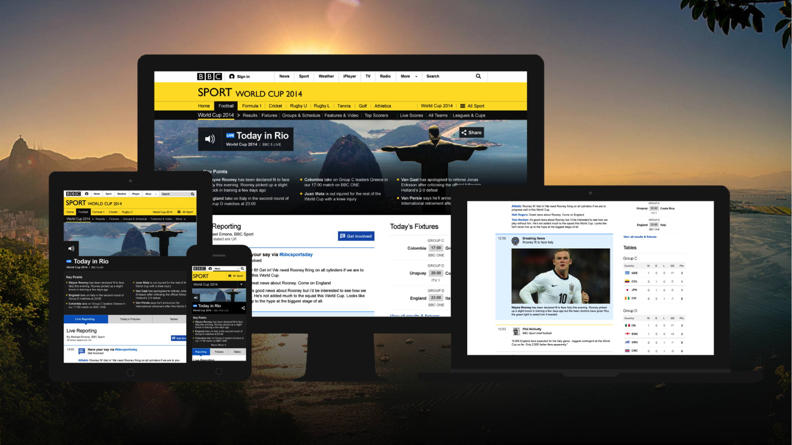

# [fit] Welcome

---

# Who

Johnathan Ishmael
Senior Technical Product Owner
[johnathan.ishmael@bbc.co.uk](mailto:[johnathan.ishmael@bbc.co.uk])

Keith Mitchell
Group Engineering Manager
[keith.mitchell@bbc.co.uk](mailto:[keith.mitchell@bbc.co.uk])

---

# What / Agenda  
1. Introduction to Digital Sport
2.  Architecting for Scale
3.  short break
4.  A Question of Sport (quiz)
4.  Deep Dive - Alerts

---

# [fit] What's
# [fit] **_Digital Sport_**
# [fit] about then?

---

# [fit] ?

There is some technical content.

**_Stop us and ask_** if we say something you don't understand.

^ We don't just want to talk at you for 50 minutes.

---

# [fit] What's our purpose?

---

# [fit] Bring the **_breadth and depth_** of Sport
# [fit] to the **_majority_** of people
# [fit] through The BBC's **_online services_**.

---

# [fit] Why?

---

# [fit] Live Sport on TV is fragmented

There is no one place on TV for all of your sport.

There are four major players in the UK:

- BT Sport
- ITV
- Sky Sports
- The BBC

---

# Want to watch Men's football?

- FIFA World Cup & Euros: The BBC / ITV
- UEFA Champions League & Europa League: BT Sport
- FA Premier League: 25% BT Sport / 75% Sky Sports
- FA Football League: Sky Sports
- FA Cup: The BBC / BT Sport
- League Cup: Sky Sports

Erm... **pay for both** BT Sport and Sky Sports?!

---

# Want to watch Women's football?

- FIFA Women's World Cup: The BBC
- UEFA Women's Championship: The BBC
- FA Women's Super League: BT Sport
- FA Women's Cup: The BBC

---

# What about Cricket?

You can watch the Indian Premier League on ITV4!

Otherwise **everything else** is on Sky Sports.

---

# Formula 1 then?

The BBC has **ten** live races in 2015 ...

... but not the iconic Monaco GP :-(

Sky Sports **has them all**.

---

# Surely Rugby is in one place?

The Six Nations and World Cup are on The BBC and ITV.

**Virtually everything else** is on BT Sport and Sky Sports.

---

# Tennis grand slams?

Wimbledon and The French Open are on The BBC and ITV.

The Australian Open and The U.S. Open are on Sky Sports.

---

# And the Golf majors?

Men's:
- The Open is on The BBC.
- The Masters, PGA and U.S. are on Sky Sports.

Women's:
- Women's British Open is on The BBC.

^ So just trying to get access to Live Sport is difficult as depending on what you want to watch you might not have access to it.
^ Thats the first problem

---

# [fit] ?

^ So if you want to watch live sport how do you do that? Short of buying all the broadcasted sport available I have no answer for you.

---

# Live sport is expensive

Some sport on The BBC and ITV is available with your TV License - £145.50.

The rest is extra.

### BT Sport is £335.88
## Sky Sports is £546.00

^ The second problem is that live sport is expensive
^ For £145.50 you get some sport on the BBC and ITV
^ For the rest you have to pay extra for it.

---

# Why is live sport so expensive?

---

# [fit] Broadcast rights cost a
# [fit] _**fortune**_

---

For example, TV rights to the FA Premier League cost Sky Sports and BT Sport

# [fit] £5,136,000,000

... for 168 games[^1].

[^1]: Source: http://www.bbc.co.uk/news/business-31379128

---

The cost of a game is around **_£10,190,000_**.

So for a 90 minute football match that's around

# [fit] £1,800 per second

---

The entire budget for the BBC in the financial year 2014-2015 was

# [fit] £4,805,000,000

... and we do TV, Radio and employ 19,000 people[^2] ...

[^2]: Source: http://downloads.bbc.co.uk/annualreport/pdf/2014-15/BBC-FS-2015.pdf

---

# I'll go to the sport instead then!

Want a season ticket at a Premier League club[^3]?

- Arsenal: £2,013
- Tottenham Hotspur: £1,895
- Manchester City: £1,750
- Chelsea: £1,250
- Manchester United: £950

[^3]: Source: http://www.telegraph.co.uk/sport/football/competitions/premier-league/11556668/Premier-League-season-ticket-prices-cut-or-frozen-for-2015-16.html

---

# [fit] Digital Sport provides a service for **_everyone_**.

---

# You can follow sport on

- Your TV
- Your laptop / desktop
- Your mobile phone / tablet

^ 50% of our traffic is from mobile devices.

---

# We provide

- Live streams (where possible)
- News and stats
- Live text commentary

^ Focus is to offer a live experience for the audience.

---

# We cover **_minor_** sports

For example:

- Archery
- Bowls
- ... and **_Handball_**

---

^ 2nd September: Team GB crushing Ireland in their first home fixture since April 2013, and their first return to the Copper Box venue since London 2012.

---

# [fit] We cover **_major_** sports

---

^ We get 20 million unique visitors a week.

^ During the Ashes 2015 half a million people were viewing the ashes Live page - all connected via websockets, all updating in real time - and that was only a cricket match...

---

---

^ We had 14 million visitors during Sochi.

---

^ In 2014 over the weekend of the Wimbledon finals and with the World Cup going on over half of the adults in the UK tuned into the BBC. We had 77.5 million visitors in the month of June.

^ Over three million people looked at our online wimbledon content on finals day.

---

^ Over the World Cup final we served 45 million page views.

^ We had 100 million page views over the entire tournament.

---

^ We had 18 million visitors during the Commonwealth Games

---

# [fit]Major events & BAU
## [fit]**_means_** 
# [fit]Scaleable Architectures
